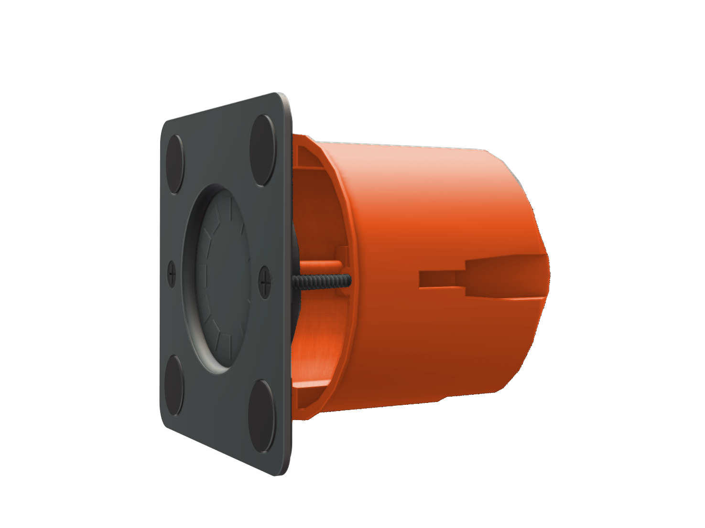

# About

The **Modo Tab Mount** is designed to make wall-mounted tablets look professional and functional.  
It integrates power delivery, clean cabling, and optional smart control.

## Advantages
- Fits EU/US standard installation boxes  
- Minimal gap (<5 mm) between wall and tablet  
- Built-in 5V/2A power supply  
- Optional ESP32-C3 for smart charging & automation  
- Support for WS2812 LEDs for status indication  

