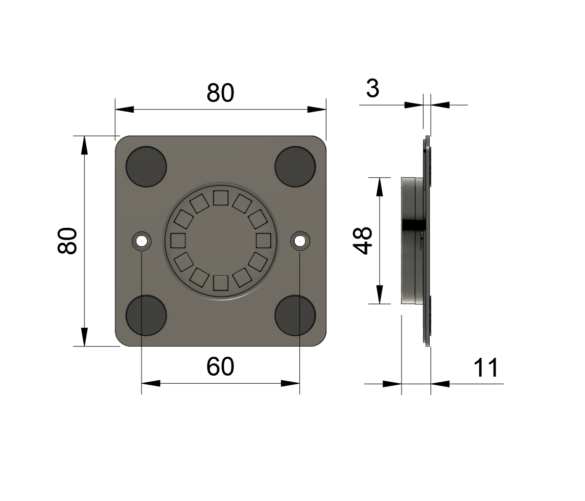

# About

Sleek, minimalistic tablet mount designed for standard EU electrical wall installation boxes. Magnetic docking makes mounting effortless, giving your tablet a clean, floating look with less than a 5 mm gap from the wall—without blocking buttons or speakers.

The mount includes a custom power supply that fits neatly into the flush installation box and is managed by an ESP32-C3 running ESPHome firmware. This enables smart charging control and optional LEDs for status indication or night light. It integrates seamlessly with Home Assistant and can also function as a Bluetooth proxy or host additional peripherals, such as presence or temperature sensors.

---

## Quick Links
- [Installation Guide](installation.md) 
- [PCB Documentation](pcb.md)
- [Shop](shop.md)
