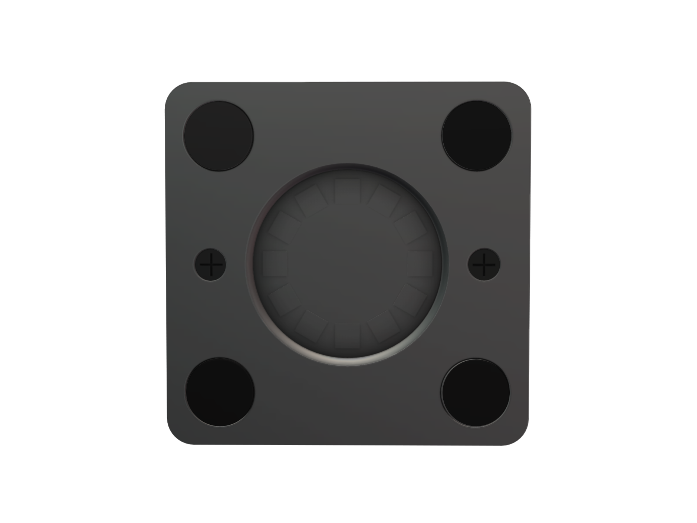
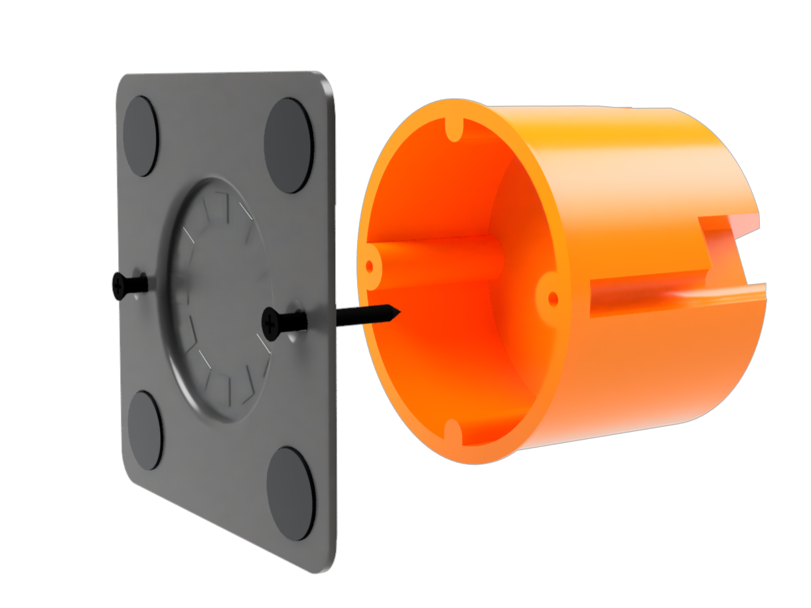

<nav class="top-nav">
  <a href="#Components">Components</a> •
  <a href="#Installation">Installation</a> •
  <a href="#Gallery">Gallery</a>
</nav>

---

# Components {#Components}
## Mounting Plate

The mounting plate serves as the base structure for wall installation. 3D-printed using PETG with carbon fiber reinforcement filament.

Designed to fit standard EU flush wall electrical installation boxes and is secured using M3 tapping screws.

Other elements of the mounting plate:
- Magnets: 12 small 5x5x5 mm neodymium N52 grade magnets with a hidden iron ring for secure magnetic attachment.
- Pads: 4 round silicone pads reduce friction and prevent scratches on the tablet.

## Tablet Plate
A 3 mm thick iron plate with a 42 mm diameter is attached to the back of the tablet using 3M VHB double-sided ultra-strong tape.
This enables a secure magnetic connection between the tablet and the mounting plate.

## USB Cable
A custom thin, flat USB Type-C cable connects the power supply to the tablet.
- Designed to fit neatly in the gap between the wall and tablet
- Mounting plate cutouts ensure proper cable routing without pinching or bending

# Power Supply
A custom power supply fits inside the standard EU wall box.

---

## Optional LEDs {#optional-leds}
The design supports WS2812 or similar LED strips, surrounding the mount. These can be
used for status indication, notifications, or ambient night lighting — all controlled
through Home Assistant.
