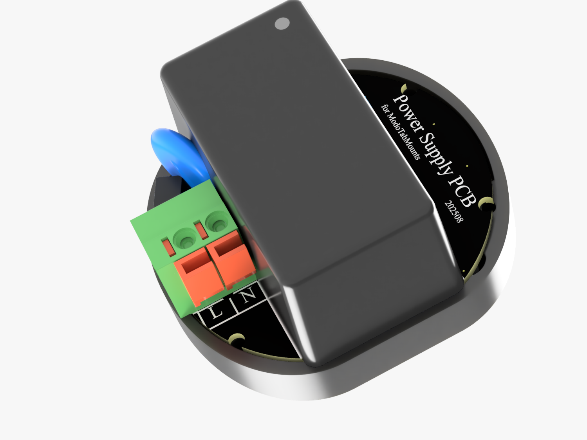

# Power Supply PCB & Documentation

This project includes a **custom power supply PCB** with an integrated **XIAO ESP32-C3 microcontroller**.  
It delivers a stable 5V output for the tablet and also provides an additional output for an **optional LED strip** around the holder plate — perfect for **status indication** or use as a subtle **night light**.  

The firmware is built with **ESPHome**, making it easily customizable for smart home enthusiasts.  
You can adapt it to your needs and make use of the available pins for additional peripherals such as:  
- Temperature and humidity sensors  
- Presence (PIR) sensor  
- Other low-power modules  

For convenience, a **dedicated 4-pin male header** is provided for sensor integration.  
See the **schematics** for detailed pin assignments and wiring.

---

## Technical Specifications
- **Power module:** Mean Well IRM-10-5 (10W AC/DC converter)  
- **Input:** 85–265V AC (universal mains voltage)  
- **Output:** 5V / 2A via flat USB-C cable  
- **Controller:** ESP32-C3 for smart switching, automation, and LED control  

---

## Documentation & Resources
- [Schematics (PDF)](files/schematics.pdf)  
- [Gerber Files (ZIP)](files/gerbers.zip)  
- [ESPHome Configuration Example](files/esphome_config.yaml) *(optional)*  
